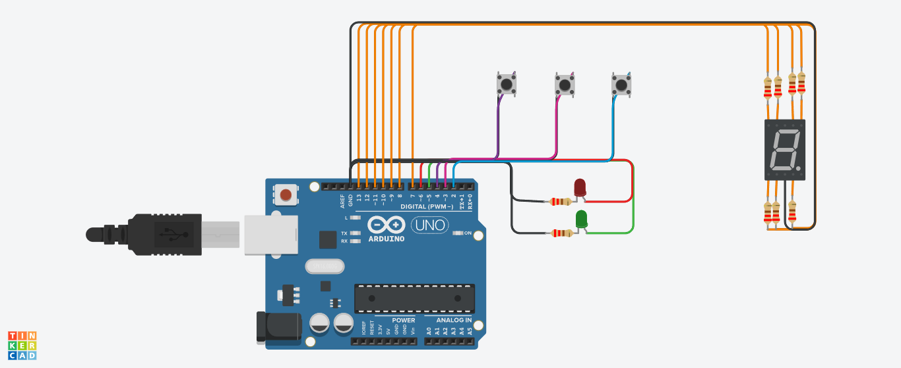

# ParcialSPD

# Integrante
- Funtanillas, Belén 

# Descripción
El siguiente documento proporciona una explicación detallada del código del modelo de montacarga funcional, diseñado como una maqueta 
para un hospital. El sistema implementado permite recibir órdenes de subir, bajar o detenerse desde diferentes pisos y muestra el estado 
actual del montacargas en un display de 7 segmentos. A continuación, se describen las funciones principales del código.

# Configuración de pines
En la sección de configuración, se definen los pines utilizados para los botones, los LED y el display de 7 segmentos. Los pines se 
inicializan como entradas o salidas correspondientes según su función en el sistema. 

~~~ C++ (lenguaje en el que esta escrito)
  #define PIN_BOTON_SUBIR 2
  #define PIN_BOTON_BAJAR 3
  #define PIN_BOTON_DETENER 4
  #define PIN_LED_VERDE 5
  #define PIN_LED_ROJO 6
  #define PIN_SEGMENTO_A 7
  #define PIN_SEGMENTO_B 8
  #define PIN_SEGMENTO_C 9
  #define PIN_SEGMENTO_D 10
  #define PIN_SEGMENTO_E 11
  #define PIN_SEGMENTO_F 12
  #define PIN_SEGMENTO_G 13

  void setup() {
    // Configuración de los pines
    pinMode(PIN_BOTON_SUBIR, INPUT_PULLUP);
    pinMode(PIN_BOTON_BAJAR, INPUT_PULLUP);
    pinMode(PIN_BOTON_DETENER, INPUT_PULLUP);
    pinMode(PIN_LED_VERDE, OUTPUT);
    pinMode(PIN_LED_ROJO, OUTPUT);
    pinMode(PIN_SEGMENTO_A, OUTPUT);
    pinMode(PIN_SEGMENTO_B, OUTPUT);
    pinMode(PIN_SEGMENTO_C, OUTPUT);
    pinMode(PIN_SEGMENTO_D, OUTPUT);
    pinMode(PIN_SEGMENTO_E, OUTPUT);
    pinMode(PIN_SEGMENTO_F, OUTPUT);
    pinMode(PIN_SEGMENTO_G, OUTPUT);

    // Inicialización de la comunicación serial
    Serial.begin(9600);
  }
~~~
  
# Función principal: loop()
La función loop() es el corazón del programa y se ejecuta continuamente en un ciclo. Aquí se controla el flujo de ejecución del 
montacargas y se actualiza el estado del display de 7 segmentos.

### Captura de estados de los botones
Se capturan los estados de los botones de subir, bajar y detener utilizando la función digitalRead().
~~~
  int botonSubir = digitalRead(PIN_BOTON_SUBIR);
  int botonBajar = digitalRead(PIN_BOTON_BAJAR);
  int botonDetener = digitalRead(PIN_BOTON_DETENER);
~~~
### Subir: while-loop del botón subir
Si se presiona el botón de subir (PIN_BOTON_SUBIR), se inicia un while-loop donde el montacargas se moverá hacia arriba, cambiando de 
piso en intervalos regulares.
~~~
  while (botonSubir == LOW) {
    // Lógica para subir el montacargas
  }
~~~
Dentro del while-loop, se actualiza el estado del montacargas y se muestra en el display de 7 segmentos. También se verifica si se ha presionado el botón de detener o el botón de bajar, y en ese caso se rompe el while-loop.

### Bajar: while-loop del botón bajar
Si se presiona el botón de bajar (PIN_BOTON_BAJAR), se inicia un while-loop donde el montacargas se moverá hacia abajo, 
cambiando de piso en intervalos regulares.
~~~
  while (botonBajar == LOW) {
    // Lógica para bajar el montacargas
  }
~~~
Dentro del while-loop, se actualiza el estado del montacargas y se muestra en el display de 7 segmentos. También se verifica si se ha presionado el botón de detener o el botón de subir, y en ese caso se rompe el while-loop.

### Detener: if-statement del botón detener
Si se presiona el botón de detener (PIN_BOTON_DETENER), se detiene el movimiento del montacargas y se muestra el estado de pausa 
en los LED correspondientes.
~~~
  if (botonDetener == LOW) {
    // Lógica para detener el montacargas
  }
~~~
Se actualiza el estado del montacargas, se muestra en el display de 7 segmentos y se encienden los LED rojos.

# Actualización del estado del display
En cada iteración del loop, se llama a la función actualizarDisplay() para mostrar el piso actual en el display de 7 segmentos. 
La función utiliza una estructura switch-case para configurar los segmentos del display según el piso.
~~~
  void actualizarDisplay(int piso) {
    switch (piso) {
      // Configuración de los segmentos para cada piso
    }
  }
~~~

# Impresión del piso y estado en el serial
Después de actualizar el estado del montacargas y el display, se llama a la función imprimir_piso() para mostrar el piso actual y 
su estado correspondiente en el monitor serial.
~~~
  void imprimir_piso(bool enMovimiento, bool enPausa) {
    // Impresión del piso y estado en el monitor serial
  }
~~~

# Link al proyecto: 
[ver proyecto](https://www.tinkercad.com/things/71gDg4oBkss-parcial-funtanillas-belen-1b/editel?sharecode=qf42aR7Akxg03_xnzuE5z2pKO5Kkm_CI5MsH8f-Go-c)

---
### Fuentes
- [Consejos para documentar](https://www.sohamkamani.com/how-to-write-good-documentation/#architecture-documentation).

- [Lenguaje Markdown](https://markdown.es/sintaxis-markdown/#linkauto).

- [Markdown Cheatsheet](https://github.com/adam-p/markdown-here/wiki/Markdown-Cheatsheet).

- [Tutorial](https://www.youtube.com/watch?v=oxaH9CFpeEE).

- [Emojis](https://gist.github.com/rxaviers/7360908).

---

  
  

